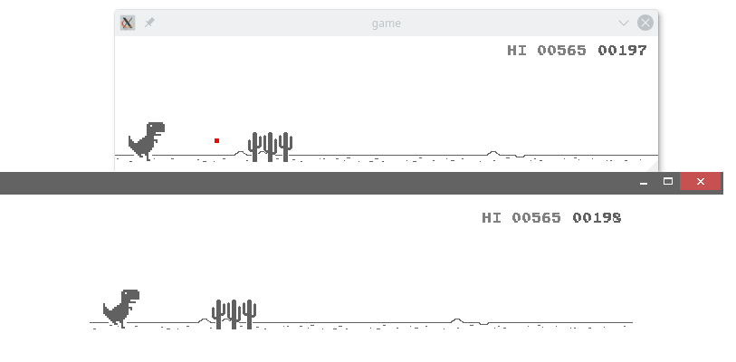

# DinostyPlayer 

## 自动玩Chrome小恐龙游戏

## 使用

编程语言:python2

第三方库:PyUserInput, PyQt4, numpy, pyopencv2

打开小恐龙游戏，画面放缩比例为100%.

将游戏切换到“重新开始“界面， 即有重新开始按钮的界面。

python2 test.py

## TODO

1. 加入人工神经网络, 让小恐龙自动调参
